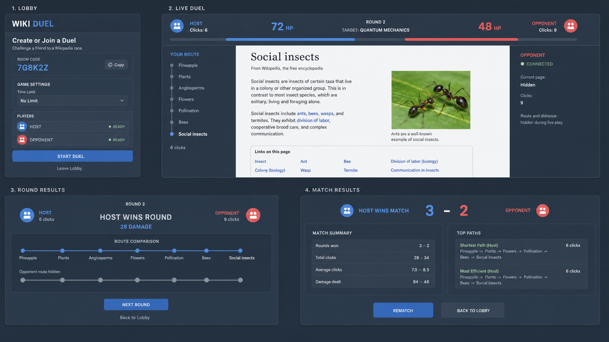

# Wiki Duel MVP Guide

> **Historical concept guide:** this file preserves the original broad product direction. The scope-refined implementation contract is [`.scratch/wiki-duel-mvp/spec.md`](./.scratch/wiki-duel-mvp/spec.md), and categorized work lives in [`.scratch/wiki-duel-mvp/BACKLOG.md`](./.scratch/wiki-duel-mvp/BACKLOG.md). Where they differ, the scope-refined spec wins.

## Working Title

**Wiki Duel**

A competitive 1v1 Wikipedia racing game where two players start on the same article and race through internal Wikipedia links to reach a shared target article. The MVP should feel closer to a competitive duel than a simple speedrun: rounds deal damage, players can recover across a match, and the post-round/path comparison should create the “I can do better next time” feeling that drives rematches.

## MVP Purpose

The MVP exists to answer one core question:

> Can a Wikipedia racing duel format create enough tension, fairness, and replayability that players voluntarily want another match?

The complete multi-round duel loop is the minimum valid test of that question. An MVP release must support successive rounds, HP damage, a match conclusion, and a low-friction rematch. A single standalone race is not a smaller Wiki Duel MVP; it tests a different product.

The MVP is not trying to prove ranked matchmaking, cosmetics, monetization, mobile support, massive scale, or long-term retention. Those only matter if the basic duel loop is fun.

## UI Inspiration

Use the previously generated UI mockup as visual inspiration for the MVP screens:



The mockup shows the intended screen families:

- Lobby screen
- Racing / duel screen
- Post-round screen
- Post-match screen

Treat this image as direction, not a strict design spec. The MVP should prioritize clarity, speed, and playtestability over visual polish.

---

# MVP Features

## 1. Private 1v1 Lobby

The MVP should support a private lobby flow where one player creates a game and shares a lobby code or invite link with another player.

The lobby should show:

- Lobby code / invite link
- Player slots
- Ready status
- Basic match settings
- Start match button for host

The lobby does not need public matchmaking, accounts, friends lists, chat, custom avatars, or ranked queues.

### Direction

The simplest version can use anonymous players identified by a generated session ID and display name. A player joins, chooses a name or accepts a default name, and is assigned Player A or Player B.

The backend should own lobby state. The frontend should not decide when a match can start. The backend should confirm that exactly two players are present and ready before creating the match.

Potential socket events:

```text
lobby:create
lobby:join
lobby:ready
lobby:update
match:start
player:disconnect
```

---

## 2. Shared Start Page and Target Page

Each round should give both players the same start article and the same target article.

Example:

```text
Start: Pineapple
Target: Quantum mechanics
```

The core race is simple:

> Click internal Wikipedia links until reaching the target article.

### Direction

For the MVP, use a curated set of round prompts rather than generating random pairs from the full Wikipedia graph. This avoids spending too much time solving graph quality before the core game loop is validated.

Each prompt should include:

```json
{
  "start": "Pineapple",
  "target": "Quantum mechanics",
  "difficulty": "medium",
  "expected_min_clicks": 6,
  "notes": "Good science/general knowledge route."
}
```

The backend should pick prompts, assign them to rounds, and send the current round state to both players.

---

## 3. Embedded Article View

The racing screen should render a simplified Wikipedia article inside the app rather than sending players to Wikipedia directly.

The player should see:

- Article title
- Lead content / useful article body
- Valid internal article links
- Current target
- Their path so far
- Click count
- Opponent status

### Direction

Do not use a raw Wikipedia iframe for the MVP. The app needs control over valid clicks, navigation, target detection, path logging, and cheating boundaries.

A practical approach:

1. Backend fetches article content from Wikipedia.
2. Backend sanitizes or normalizes the content.
3. Backend extracts valid internal article links.
4. Frontend renders a simplified article view.
5. Link clicks are intercepted and sent to the backend.
6. Backend validates the transition and returns the next article.

The MVP does not need perfect Wikipedia fidelity. It only needs a readable article experience with enough links to support racing.

### Allowed Link Rules

Only allow normal article namespace links.

Generally exclude:

- External links
- Citation links
- Edit links
- Help pages
- File pages
- Category pages
- Talk pages
- Special pages
- Search
- Red links
- In-page footnote jumps

Redirects should be normalized to their canonical article title.

---

## 4. Click-Based Navigation and Path Tracking

Each player’s path should be tracked from the start article to their current article.

Example path:

```text
Pineapple -> Plants -> Flowers -> Pollination -> Bees -> Social insects
```

The UI should show the player’s path during the round and both players’ paths after the round.

### Direction

The backend should be authoritative for path state.

For every valid click, store:

```text
match_id
round_id
player_id
from_page
to_page
click_number
timestamp
```

This allows post-round comparison, analytics, debugging, and later anti-cheat review.

The frontend can keep a local path for instant UI response, but the source of truth should remain the backend.

Potential socket events:

```text
page:navigate
page:update
path:update
round:target_reached
```

---

## 5. Live Opponent Status

The duel screen should show enough opponent information to create tension without overwhelming the player.

Show:

- Opponent current page title
- Opponent click count
- Opponent HP
- Optional: opponent estimated distance to target, if available

Do not show the opponent’s full live path by default during a round. Save that reveal for the post-round screen.

### Direction

The opponent status should update through sockets whenever a player changes pages.

A minimal status object:

```json
{
  "playerId": "p2",
  "currentPage": "Evolution",
  "clickCount": 9,
  "hp": 48,
  "connected": true
}
```

For the MVP, avoid complex live spectating. Keep the UI focused on the current race.

---

## 6. Round Timer and Click Counter

Each round should track time and clicks.

The click counter is essential because it supports damage, path comparison, and player improvement.

The timer is useful for tension and analytics, but it should not dominate the first MVP unless time limits are part of the chosen match rules.

### Direction

The backend should assign the official round start time.

The frontend can display a local timer based on the server-provided start timestamp.

Possible round modes:

- No time limit for earliest playtests
- Soft time limit, such as 5 minutes
- Hard time limit if both players get stuck

For early testing, a soft round cap is recommended. If neither player reaches the target after the cap, end the round and calculate low or no damage based on current progress.

---

## 7. HP and Damage System

The MVP should use a GeoGuessr-style duel structure where each round deals damage instead of simply ending the entire match.

A starting point:

```text
Each player starts with 100 HP.
First player to reach the target wins the round.
The winner deals damage to the loser.
First player reduced to 0 HP loses the match.
```

### Direction

Use a simple damage formula first.

Prototype formula:

```text
damage = 25 + 3 × (loser_clicks - winner_clicks)
```

Then clamp it:

```text
minimum damage: 15
maximum damage: 60
```

Example:

```text
Winner clicks: 6
Loser clicks: 9
Damage = 25 + 3 × (9 - 6) = 34
```

This is not theoretically perfect, but it is good enough to test whether the damage-based duel loop is fun.

### Later Improvement

Once a Wikipedia graph exists, damage can include remaining shortest-path distance:

```text
damage = base_damage
       + remaining_distance_bonus
       + click_efficiency_bonus
       + time_bonus
```

Do not build this first. The MVP should avoid graph preprocessing unless the basic duel loop already shows promise.

---

## 8. Post-Round Path Comparison

After each round, show both players what happened.

The post-round screen should include:

- Round winner
- Damage dealt
- Target article
- Winner path
- Loser path
- Click counts
- Time taken
- HP after the round
- Next round button

This screen is important because it creates learning, debate, and rematch desire.

### Direction

The path comparison should make players say things like:

> “I should have gone through Biology instead.”

or:

> “How did you get there in six clicks?”

This social comparison is part of the product. The post-round screen should not be treated as a boring stats page.

Potential socket events:

```text
round:end
round:summary
round:next_ready
round:start_next
```

---

## 9. Post-Match Summary

At the end of the match, show a final result screen.

Include:

- Winner
- Final score / HP result
- Rounds won
- Damage by round
- Best path
- Most efficient round
- Rematch button
- Back to lobby button

### Direction

The post-match screen should encourage an immediate rematch. This is one of the most important MVP behaviors to test.

The rematch flow should be low friction:

1. Both players click rematch.
2. Backend creates a new match in the same lobby.
3. New curated prompts are selected.
4. Players start again.

Do not require players to recreate the lobby manually after every match.

---

## 10. Curated Prompt Set

The MVP should start with manually curated race prompts.

Target: 50 to 100 prompts.

Each prompt should be tested for rough difficulty and basic reachability.

### Direction

Create prompts across several categories:

- Pop culture
- History
- Science
- Geography
- Sports
- Technology
- Literature
- Food
- Animals
- Politics / world events, only if not too sensitive or volatile

Prompt quality matters more than prompt quantity.

Good prompts should have:

- Recognizable start and target articles
- Multiple plausible routes
- A target reachable in roughly 4 to 9 clicks
- Enough uncertainty to create decision-making
- Not too many cheap hub-page shortcuts

Avoid prompts that depend heavily on:

- Obscure stubs
- Disambiguation pages
- Year pages
- List pages
- Extremely niche local pages
- Articles with very few links

---

# Locked MVP Tech Stack

## Frontend

```text
Vite + React + TypeScript
```

### Why

A standard SPA is a good fit because the app does not need server-side rendering. The core experience is an interactive realtime game client connected to a separate backend.

Vite keeps the frontend simple, fast, and independent from the backend.

## UI Styling

```text
Tailwind CSS
Optional: shadcn/ui for reusable components
```

### Why

The MVP needs quick UI iteration. Tailwind is practical for rapidly building the lobby, duel HUD, article layout, and summary screens.

shadcn/ui is useful if you want polished dialogs, buttons, cards, tabs, and form elements without committing to a heavy component framework.

## Client State

```text
Zustand
```

### Why

Zustand is lightweight and works well for game-like UI state.

Store client-side UI state such as:

```text
currentPage
currentPath
clickCount
opponentStatus
roundState
matchState
socketStatus
selectedLobby
localPlayer
```

The frontend should not be the authority on match results, damage, or valid navigation.

## Server State / Fetching

```text
TanStack Query, optional
```

### Why

Most live game state will arrive through sockets. TanStack Query is useful for non-realtime HTTP data:

- Loading lobby details
- Fetching article content if not socket-driven
- Fetching match history
- Fetching prompt lists for dev/admin tools

It is optional for the first prototype.

## Realtime Transport

```text
Socket.IO
```

### Why

Socket.IO is a practical choice for an MVP because it gives rooms, reconnect behavior, and a simple event model. Raw WebSockets would work, but would require more custom infrastructure around rooms, reconnects, message handling, and heartbeats.

Use one socket room per lobby or match.

## Backend

```text
Node.js + TypeScript
Fastify or Express
```

### Recommendation

Use Fastify if you want a cleaner, more structured backend.

Use Express if you want maximum familiarity and the simplest possible setup.

Either is fine for the MVP. The more important decision is keeping the backend authoritative for match state.

## Database

```text
Postgres
```

### Why

Postgres is reliable, familiar, and flexible enough for match logs, prompts, paths, cached pages, and future user accounts.

## ORM / Query Builder

```text
Drizzle
```

### Why

Drizzle fits the preference for a more SQL-like, lightweight, type-safe database layer. It avoids some of the heavier abstraction associated with larger ORMs while still giving useful TypeScript integration.

## Cache

```text
No Redis initially, unless needed
```

### Why

For the MVP, live match state can probably live in backend memory if there is only one backend instance.

Add Redis later if you need:

- Multiple backend instances
- Socket.IO Redis adapter
- Shared room state
- Faster page/article cache
- Job queues

## Deployment

Practical MVP deployment:

We will deploy the MVP to a personal server running Dokploy. Dokploy can handle deploying a project with multiple services within it or can deploy one project with one service containing a docker compose made up of multiple things. I commonly use this for hosting personal web apps and self hosted projects, so it is perfect for a prototype MVP like this. So long as the MVP can be deployed via Docker, deployment will not be a blocker.

---

# High-Level Backend Model

## Core Entities

### Lobby

Represents a waiting room before a match.

Fields may include:

```text
id
code
host_player_id
status
created_at
```

### Player Session

Represents a player in a lobby or match.

Fields may include:

```text
id
lobby_id
display_name
socket_id
connected
created_at
```

### Match

Represents a full duel.

Fields may include:

```text
id
lobby_id
status
player_a_id
player_b_id
player_a_hp
player_b_hp
winner_player_id
created_at
completed_at
```

### Round

Represents one start-target race inside a match.

Fields may include:

```text
id
match_id
round_number
start_page
target_page
status
winner_player_id
damage_dealt
started_at
completed_at
```

### Player Path Entry

Represents one click in a round.

Fields may include:

```text
id
round_id
player_id
click_number
from_page
to_page
timestamp
```

### Curated Prompt

Represents a race pair.

Fields may include:

```text
id
start_page
target_page
difficulty
expected_min_clicks
enabled
notes
```

### Cached Page

Represents cached Wikipedia article content and valid links.

Fields may include:

```text
title
canonical_title
html_or_blocks
valid_links_json
fetched_at
source_revision_optional
```

---

# Public Testing

## Testing Philosophy

The MVP should be tested like a game prototype, not like a finished SaaS product.

The goal is to determine whether the duel mechanic creates repeated voluntary play.

The main question is not:

> Did users understand the app?

The main question is:

> Did users want another match without being pushed?

A successful test should show that players experience tension, feel that losses are explainable, and believe they can improve.

## What We Are Trying to Learn

The public test should answer:

- Do people understand the rules quickly?
- Are rounds too easy, too hard, or about right?
- Does the damage system feel fair?
- Does the post-round path comparison create discussion?
- Do players ask for a rematch?
- Do players want alternate modes, or is the base duel enough?
- Are people losing because the game is interesting or because the UI is confusing?
- Are there common pages/routes that dominate too many rounds?
- Do players feel like skill matters?

## Success Signals

Strong signals:

- Players voluntarily rematch.
- Players play 3 or more matches in one session.
- Players discuss routes after rounds.
- Players say they lost because of a decision, not because the game was random.
- Players share the game with someone else.
- Players ask for ranked, daily challenges, or more prompts.

Weak signals:

- Players say “neat” but do not rematch.
- Players only play because you are watching.
- Players enjoy the concept but find the rounds frustrating.
- Players treat the post-round screen as unimportant.

Negative signals:

- Players frequently get stuck and quit.
- The same shortcut routes dominate every round.
- Players feel the damage calculation is arbitrary.
- Players cannot tell what the opponent is doing.
- Players say the experience feels like homework.

## How We Get the Data

Collect both behavioral data and lightweight feedback.

### Behavioral Analytics

Track these automatically:

```text
match_created
match_started
match_completed
match_abandoned
rematch_requested
rematch_started
round_started
round_completed
round_timed_out
player_reached_target
player_disconnected
```

For each round, log:

```text
start_page
target_page
difficulty
winner
winner_clicks
loser_clicks
winner_time_to_target
loser_final_page
round_duration
damage_dealt
both_player_paths
```

For each match, log:

```text
match_duration
rounds_played
final_hp
winner
rematch_requested_by_player_a
rematch_requested_by_player_b
rematch_started
abandon_reason_if_known
```

Useful calculated metrics:

```text
average round duration
average match duration
completion rate
rematch rate
round timeout rate
average clicks to target
prompt difficulty by actual performance
damage distribution
percentage of matches ending too quickly
percentage of matches dragging too long
```

### Lightweight Player Feedback

After a match, ask 2 to 4 quick questions.

Examples:

```text
How fun was this match? 1-5
How fair did the damage feel? 1-5
Was the round difficulty too easy, too hard, or about right?
Would you play another match? yes/no
```

Optional free-text prompt:

```text
What was the most frustrating or confusing part?
```

Do not overload testers with long surveys. The most valuable feedback is whether they keep playing.

### Playtest Observation

For early testing, watch a few people play live or over screen share.

Look for:

- Confusion around what links are clickable
- Whether players understand the target
- Whether they notice opponent progress
- Whether the HP system creates tension
- Whether the post-round path screen creates conversation
- When players stop having fun

Write down moments where players say things like:

```text
I don't know where to go.
Wait, how did you get there?
That's unfair.
One more.
I should have clicked that instead.
```

Those comments are more useful than polished feedback.

## Public Test Shape

Start small.

Suggested phases:

### Phase 1: Closed Friend Test

5 to 10 people.

Goal: find obvious UX and technical problems.

### Phase 2: Small Public Link

20 to 50 players.

Goal: test whether strangers understand the loop and whether rematches happen.

### Phase 3: Focused Duel Night

Invite people to play at the same time.

Goal: observe repeated matches, prompt quality, and whether the experience has social energy.

## MVP Decision Criteria

Continue investing if:

- Rematch rate is meaningfully high.
- Players complete matches without handholding.
- Average match length feels manageable.
- Players talk about route choices.
- Prompt difficulty can be tuned with data.

Pause or rethink if:

- Most people play once and stop.
- Rounds are frequently frustrating rather than tense.
- Winning feels random.
- The app requires too much explanation.
- The fun depends entirely on novelty.

---

# Known MVP Risks and Challenges

## Wikipedia Content Messiness

Wikipedia pages contain tables, infoboxes, references, pronunciation, images, navboxes, coordinates, and many kinds of links. Rendering a clean article view will take more time than expected.

Recommended MVP response:

- Simplify article rendering aggressively.
- Show enough article content to make navigation possible.
- Prioritize valid links over perfect visual fidelity.

## Prompt Quality

Poor prompts can make the whole game feel bad.

Recommended MVP response:

- Curate prompts manually.
- Log performance by prompt.
- Disable bad prompts quickly.
- Treat prompt quality as game design, not just data.

## Fairness

Players may disagree with damage results.

Recommended MVP response:

- Keep the damage formula simple and visible.
- Show why damage happened.
- Cap extreme damage.
- Tune after playtests.

## Cheating

Players can use external search, AI, or another Wikipedia tab.

Recommended MVP response:

- Ignore serious anti-cheat for early friend/public tests.
- Keep matches casual and unranked.
- Track suspicious route behavior later.

## Disconnections

Realtime games need to handle disconnects gracefully.

Recommended MVP response:

- Show disconnected status.
- Allow short reconnect windows.
- If a player does not return, end or forfeit the match.

## Backend Authority

The frontend should not decide winners, damage, or valid navigation.

Recommended MVP response:

- Validate navigation server-side.
- Calculate damage server-side.
- Store paths server-side.
- Treat frontend state as display-only.

---

# Future

## Future Tech Stack

Possible future technical improvements:

### Redis

Add Redis when scaling beyond a single backend instance.

Use cases:

- Socket.IO Redis adapter
- Shared match state
- Pub/sub between servers
- Fast page cache
- Job queues

### Wikipedia Snapshot Graph

Move from live Wikipedia API usage to a preprocessed Wikipedia snapshot.

Benefits:

- Deterministic matches
- Fairer competitive play
- Reliable shortest-path calculations
- Better difficulty generation
- More stable page/link behavior

### Graph Processing Pipeline

Build a pipeline that extracts:

```text
article nodes
redirects
valid links
outbound adjacency lists
shortest path samples
centrality metrics
page popularity signals
```

This can power automatic prompt generation, better damage, and anti-cheat signals.

### Dedicated Match Workers

If realtime load grows, move active match management into dedicated room/match workers.

Potential approaches:

- Node worker processes
- Redis-backed room state
- Cloudflare Durable Objects
- Elixir/Phoenix Channels
- Go realtime service

Do not move here until the MVP proves demand.

### Authentication

Add accounts only when needed for:

- Ranked play
- Match history
- Friends
- Ratings
- Progression
- Moderation

## Future Features

Potential future features:

- Public matchmaking
- Ranked ladder
- Elo or skill rating
- Seasons
- Daily duel
- Weekly challenge
- Spectator mode
- Shareable match replays
- Route replay timeline
- Player profiles
- Prompt editor/admin tool
- Custom private match settings
- Team lobbies
- Better onboarding/tutorial
- Accessibility improvements
- Mobile-optimized layout
- Moderation/reporting tools

## Future Ideas

Possible product directions:

### Creator-Friendly Challenges

Let users create and share challenges like:

```text
Taylor Swift -> Roman Empire
Pokémon -> Existentialism
Shark -> Albert Einstein
```

This could make the game more shareable than random matchmaking alone.

### Daily Global Route

One shared challenge per day where everyone compares paths and times.

This could become a lightweight retention loop.

### Route Replay

After a match, allow players to replay both paths step by step.

This would make the game more watchable and educational.

### Prompt Quality Scoring

Use analytics to rank prompts by actual fun and fairness.

Possible prompt stats:

```text
completion rate
average clicks
average time
timeout rate
rematch rate after prompt
player rating
path diversity
```

### Knowledge Graph Visualization

Show a small graph after a match showing how both paths moved through topics.

This should not be part of the MVP, but it could become a distinctive visual identity.

## Future Gamemodes

### Standard Duel

The main mode: shared start, shared target, HP damage across rounds.

### Hidden Target Clue Mode

Players are given clues instead of the exact target.

Example:

```text
Start: Shark
Clues: European, scientist, relativity
Target: Albert Einstein
```

This adds deduction before navigation.

### Reverse Guess Mode

Players see a partially hidden Wikipedia article and must identify it, then race to it or from it.

### Draft Mode

Players ban categories or themes before the match.

Example:

```text
Player A bans Sports
Player B bans Movies
```

The system generates prompts outside those categories.

### Power-Up Mode

Add limited-use abilities such as:

- Reveal a hint
- Show one shortest-path direction
- Teleport to a previous page
- Hide opponent status briefly
- Freeze opponent path reveal

This should be treated as an alternate arcade mode, not the first competitive baseline.

### Team Duel

Two teams race collaboratively. This could work well for voice chat or streaming.

### Territory Mode

Players capture visited articles as territory on the Wikipedia graph. This is a larger design and should be explored only after the standard duel proves fun.

---

# Final MVP Build Principle

Build the smallest version that can answer this question honestly:

> Did players want to play again?

If the answer is yes, the project earns more investment.

If the answer is no, better infrastructure will not save it.
